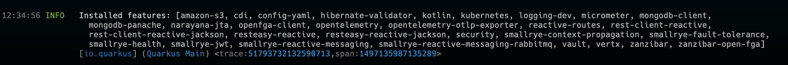
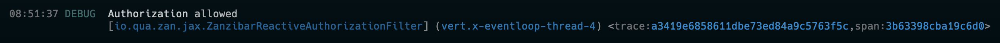
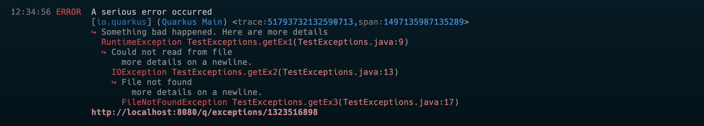
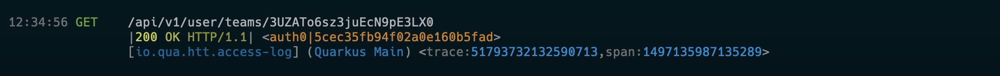

# Quarkus Dev Mode Logging

## Logging exclusively for development mode

The goal is to provide an easily readable, concise, and colorized logging format that is designed exclusively for working in development mode.

### Message Wrapping & Indenting
Long messages are automatically wrapped and then indented accordingly.

### Context Information

Context information is moved to its own line and indented appropriately. Additionally, trace information is logged when the OpenTelemetry extension is included. 

All context information is painted in varying shades of blue.

### Concise Exceptions with Detail Links 

Exception are logged in a tree indentation format without full a stacktrace to allow easy review of logs. A link to full exception details, with a complete stack trace, is added to all logged exceptions.

Exception related information is painted in varying shades of red.

### HTTP Specific Formatting

HTTP access logging is formatted in an easy to read multi-line format that skips the redundant log level. HTTP specific information is broken out onto its own line with the normal context line following.

HTTP context information is painted in varying shades of yellow.

